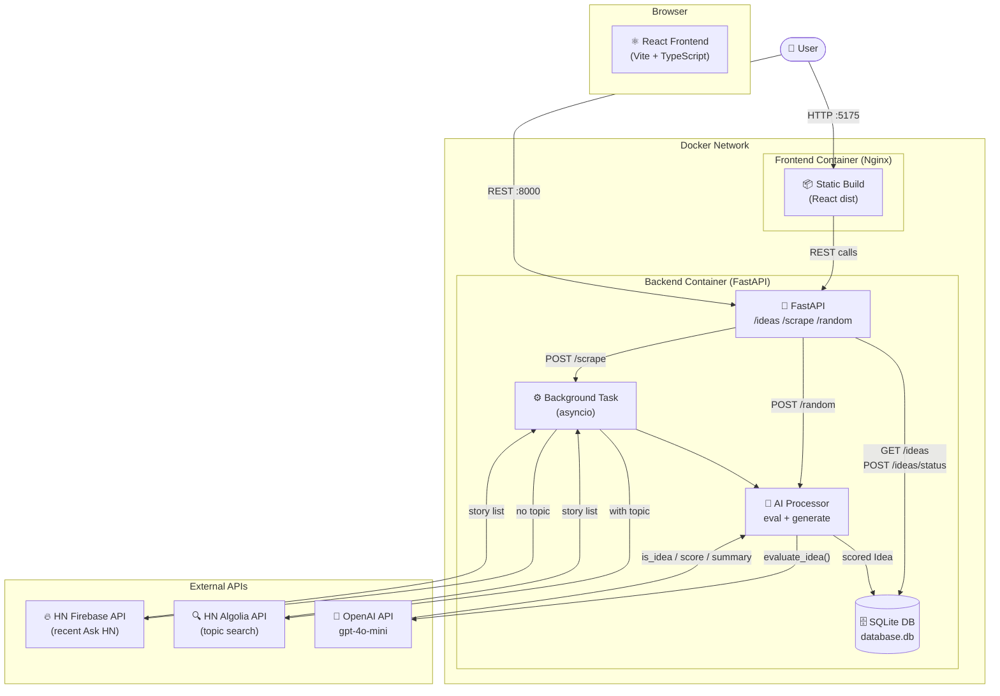

# Orbit Ideas

Discover AI-curated business opportunities from the internet.

Orbit Ideas is a full-stack web application that scrapes Hacker News for business ideas, uses Large Language Models (LLMs) to evaluate and score their viability, and presents them in a premium dark-mode dashboard for review.

## Features

- **Automated Web Scraping** — Pulls the latest Ask HN threads via the HN Firebase API.
- **AI Filtering & Scoring** — Uses OpenAI `gpt-4o-mini` to determine if a post is a valid business idea, summarize it, identify the target audience, and assign a confidence score (0–100).
- **Topic Search** — Narrows scraping to a specific niche (e.g. `"fintech"`, `"productivity"`) using Hacker News' Algolia Search API.
- **Random Idea Generator** — Brainstorm a spontaneous, unique startup idea directly from the LLM.
- **Idea Management** — Approve, reject, or star ideas from the UI. Ideas are persisted across sessions.
- **Premium UI** — Dark mode, glassmorphism cards, and fluid micro-animations.

## Architecture



### Request Flow

| Action | Flow |
|--------|------|
| Load page | `React` → `GET /ideas?status=pending` → `SQLite` |
| Scrape (no topic) | `React` → `POST /scrape` → Background task → `HN Firebase API` → `OpenAI` → `SQLite` |
| Scrape (with topic) | `React` → `POST /scrape?topic=X` → Background task → `HN Algolia API` → `OpenAI` → `SQLite` |
| Generate random | `React` → `POST /random` → `OpenAI` → `SQLite` → response |
| Approve / Reject / Star | `React` → `POST /ideas/{id}/status?status=X` → `SQLite` |

## Tech Stack

| Layer | Technology |
|-------|-----------|
| Frontend | React 18, Vite, TypeScript, Custom CSS (Glassmorphism) |
| Backend | Python 3.11, FastAPI, Uvicorn |
| Database | SQLite via SQLModel (SQLAlchemy) |
| AI | OpenAI Python SDK — `gpt-4o-mini` (swappable with Ollama) |
| Scraping | Python `requests`, HN Firebase REST API, Algolia Search API |
| Deployment | Docker, Docker Compose, Nginx |

## Environment Variables

Create a `.env` file inside the `backend/` directory:

```env
OPENAI_API_KEY=sk-...
```

For the frontend to reach the backend in **Docker/production**, set `VITE_API_BASE_URL` at build time or via the `frontend/.env` file:

```env
VITE_API_BASE_URL=http://<your-server-ip>:8000
```

> If `VITE_API_BASE_URL` is not set, the frontend defaults to `http://localhost:8000`.

## Running Locally

### Prerequisites

- Node.js v18+
- Python 3.11+
- An OpenAI API Key

### 1. Backend

```bash
cd backend
python3 -m venv venv
source venv/bin/activate
pip install -r requirements.txt

# Create .env with your key
echo "OPENAI_API_KEY=your_key_here" > .env

# Start the server
python main.py
```

Backend runs on `http://localhost:8000`. Interactive API docs at `http://localhost:8000/docs`.

### 2. Frontend

```bash
cd frontend
npm install
npm run dev
```

Frontend runs on `http://localhost:5173`.

## Deployment

### Option A: Docker Compose (VPS — DigitalOcean / Hetzner / Linode)

**Prerequisites:** Docker Engine, Docker Compose, a Linux VPS.

```bash
# 1. Clone the repo
git clone https://github.com/thakur-rishabh/idea-scrapper.git
cd idea-scrapper

# 2. Set your API key (picked up by docker-compose as ${OPENAI_API_KEY})
export OPENAI_API_KEY=sk-...

# 3. (Optional) Set the frontend's API URL for production
#    Edit frontend/.env or pass at build time:
#    VITE_API_BASE_URL=http://<your-vps-ip>:8000

# 4. Build and start
docker-compose up -d --build
```

| Service | Port |
|---------|------|
| Frontend (Nginx) | `http://your-ip:5175` |
| Backend API | `http://your-ip:8000` |
| API Docs | `http://your-ip:8000/docs` |

SQLite data is persisted to `./backend/database.db` via a volume mount.

### Option B: Nvidia Jetson (Local AI — Jetson Nano / Orin)

The Jetson is an excellent deployment target because Docker Compose runs as-is on ARM64, and you can **replace the OpenAI API with a free local Ollama instance** running on the Jetson's GPU — eliminating ongoing API costs.

**1. Install Ollama on the Jetson host:**

```bash
curl -fsSL https://ollama.com/install.sh | sh
ollama pull mistral   # or llama3, phi3, gemma2 etc.
```

**2. Point the AI processor to Ollama** — edit `backend/ai_processor.py`:

```python
# Replace:
client = AsyncOpenAI(api_key=os.getenv("OPENAI_API_KEY", "dummy"))

# With:
client = AsyncOpenAI(
    base_url="http://host.docker.internal:11434/v1",
    api_key="ollama"  # required field, value ignored by Ollama
)
```

Also change `model="gpt-4o-mini"` to `model="mistral"` (or whichever model you pulled).

**3. Deploy with Docker Compose** — same as Option A.

> **Model recommendations by hardware:**
> - Jetson Nano (4GB) — `phi3:mini`, `gemma2:2b`
> - Jetson Orin (8–64GB) — `mistral`, `llama3`, `deepseek-r1:8b`

## API Reference

| Method | Endpoint | Description |
|--------|----------|-------------|
| `GET` | `/ideas?status=pending` | List ideas by status (`pending`, `approved`, `rejected`, `starred`) |
| `POST` | `/scrape?topic=<str>` | Trigger background scrape. `topic` is optional. |
| `POST` | `/ideas/{id}/status?status=<str>` | Update idea status |
| `POST` | `/random` | Generate and store a random AI idea |

Full interactive docs: `http://localhost:8000/docs`

## Project Structure

```
idea-scrapper/
├── backend/
│   ├── main.py           # FastAPI app, all route handlers
│   ├── scraper.py        # HN scraping logic (Firebase + Algolia)
│   ├── ai_processor.py   # OpenAI evaluation & idea generation
│   ├── models.py         # SQLModel Idea table definition
│   ├── database.py       # DB engine + session factory
│   ├── requirements.txt
│   └── Dockerfile
├── frontend/
│   ├── src/
│   │   ├── App.tsx       # Main app shell, state, API calls
│   │   └── components/
│   │       └── IdeaCard.tsx
│   ├── nginx.conf
│   └── Dockerfile
└── docker-compose.yml
```

## Roadmap

- **Additional Sources** — Extend `scraper.py` to ingest from Reddit (`r/SomebodyMakeThis`, `r/startups`) and Product Hunt using the same modular pipeline.
- **Local LLM (Ollama)** — Route `AsyncOpenAI` client to a local Ollama instance for zero-cost inference (works today on Nvidia Jetson Orin).
- **Scheduled Scraping** — Add a cron/APScheduler job to auto-scrape on a schedule instead of requiring manual trigger.
- **Export** — Download approved/starred ideas as CSV or Markdown.
