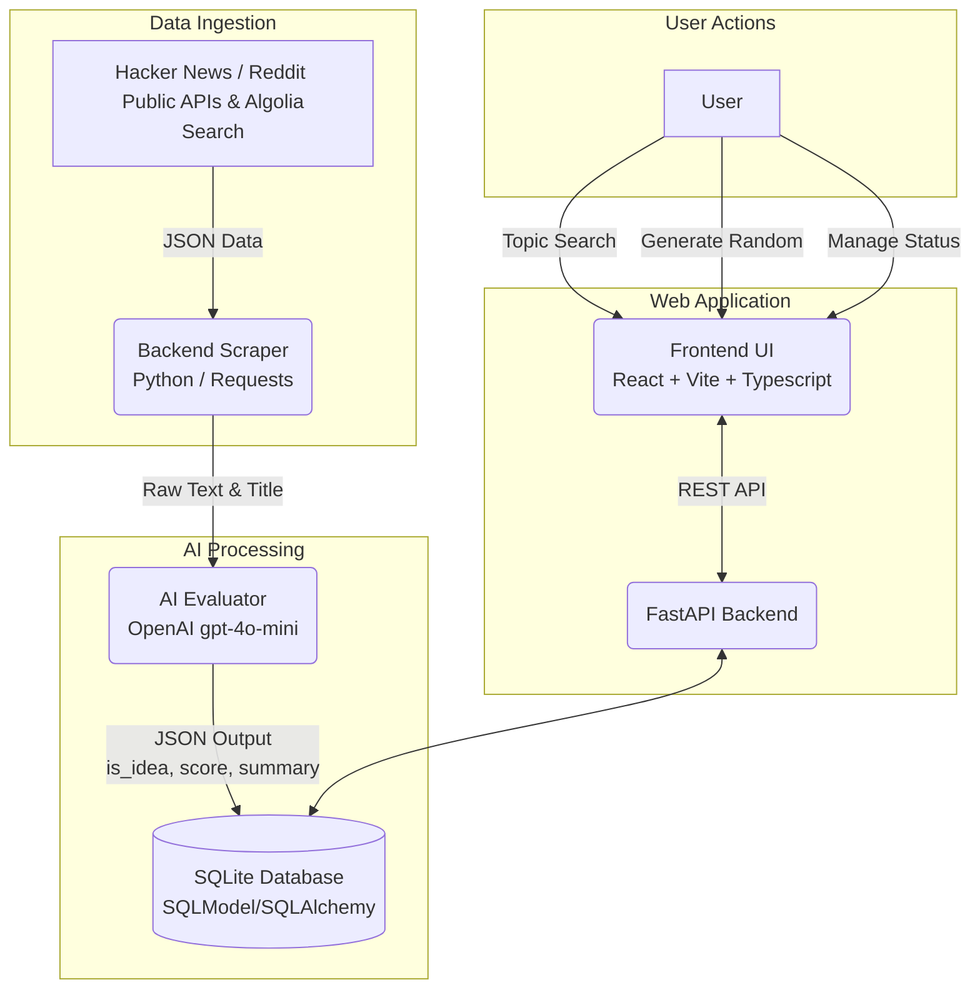

# Orbit Ideas

Discover AI-curated business opportunities from the internet.

Orbit Ideas is a full-stack web application that scrapes the web (Hacker News) for business ideas, uses Large Language Models (LLMs) to evaluate and score their viability, and presents them in a beautiful, premium dark-mode dashboard.


## Features
- **Automated Web Scraping**: Connects to Hacker News API to pull the latest community threads.
- **AI Filtering & Scoring**: Uses OpenAI (`gpt-4o-mini`) to determine if a post is a valid business idea, summarize it, identify the target audience, and assign a confidence score (0-100).
- **Topic Search**: Narrow down your scraping to specific niches (e.g., "fintech", "productivity") using HN's Algolia Search API.
- **Random Idea Generator**: Instantly brainstorm a spontaneous, unique startup idea using the LLM.
- **Idea Management**: Approve, reject, or star ideas directly from the UI.
- **Premium UI**: Dark mode, glassmorphism, and fluid micro-animations.

## Architecture




## Tech Stack
*   **Frontend**: React, Vite, TypeScript, Custom CSS (Glassmorphism & CSS Animations).
*   **Backend**: Python, FastAPI, SQLModel (SQLAlchemy wrapper), Uvicorn.
*   **Database**: SQLite (local `.db` file for easy portability).
*   **AI Integration**: OpenAI Python SDK (`gpt-4o-mini`).
*   **Deployment**: Docker & Docker Compose.

## Running Locally

### Prerequisites
- Node.js (v18+)
- Python (3.11+)
- An OpenAI API Key

### 1. Backend Setup
```bash
cd backend
python3 -m venv venv
source venv/bin/activate
pip install -r requirements.txt

# Create a .env file and add your API key
echo "OPENAI_API_KEY=your_key_here" > .env

# Run the server
python main.py
```
*The backend will run on `http://localhost:8000`*

### 2. Frontend Setup
```bash
cd frontend
npm install

# Run the dev server
npm run dev
```
*The frontend will run on `http://localhost:5173` (or the port specified by Vite).*

## Deployment (Docker VPS)

This project is configured to run instantly on any cheap Linux VPS (like DigitalOcean, Linode, or Hetzner) using Docker.

1. SSH into your VPS.
2. Clone this repository.
3. Add your `.env` file into the `backend/` directory.
4. Run:
```bash
docker-compose up -d --build
```
This handles spinning up the backend API, the SQLite persistent volume, and the frontend Nginx web server on port 80.

## Future Roadmap
- **Social Media Expansion**: Extend `scraper.py` to ingest from Twitter/X and Reddit APIs using the exact same underlying modular pipeline.
- **Open-Source LLMs**: Point the `AsyncOpenAI` client base URL in `ai_processor.py` to a local Ollama or vLLM instance to run the AI engine for free.
